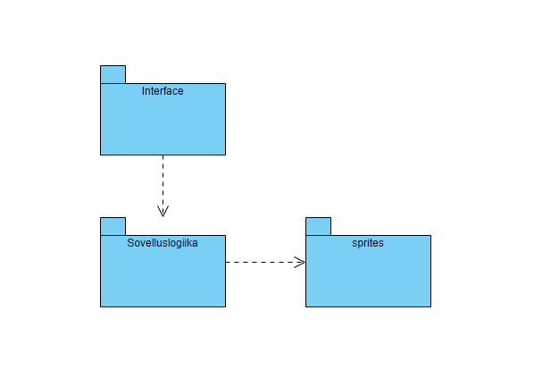
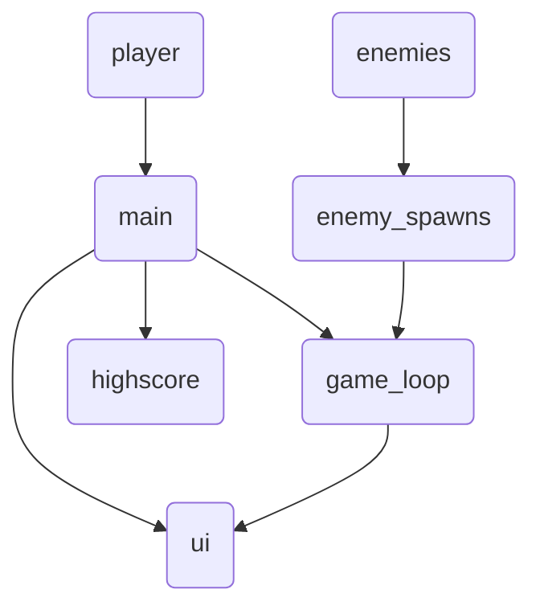
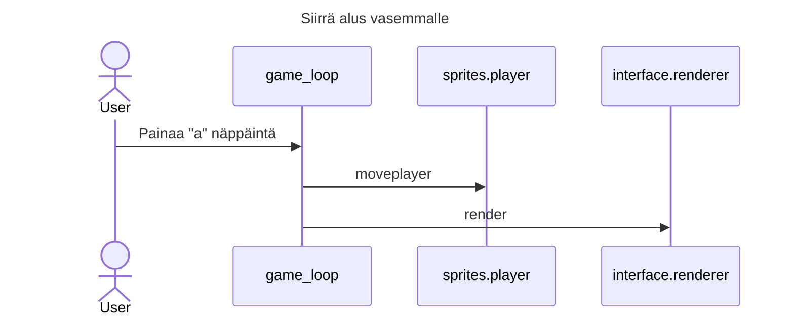

# Arkkitehtuuri

## Rakenne

Sovellus on jaettu kolmeen osaan, sprites sisältää näytöllä näkyvät oliot, interface sisältää käyttöliittymää
koskevan koodin, ja viimeinen osa on varsinainen sovelluslogiikka.

#### Luokkakaavio

## Käyttöliittymä

Käyttöliittymä koostuu kahdesta eri näkymästä. Varsinainen graaphinen pelinäkymä, sekä terminaalin highscore näkymä. Käyttölittymä on eristetty varsinaisesta sovelluslogiikasta

## Päätoiminnallisuudet

Aluksen ohjaus:

