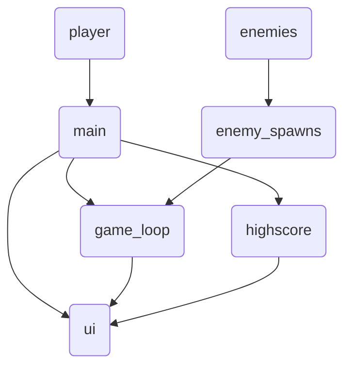
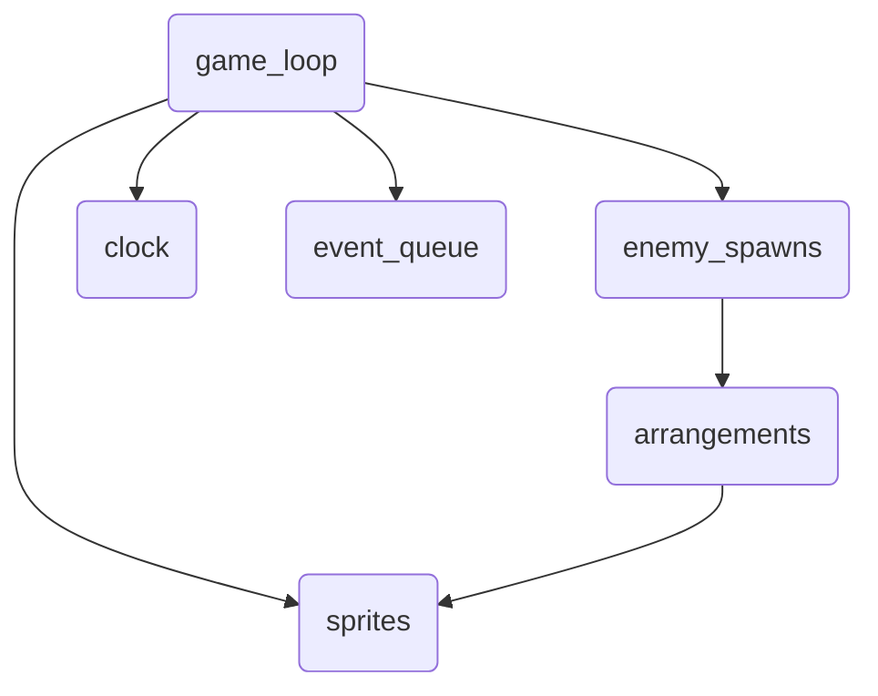
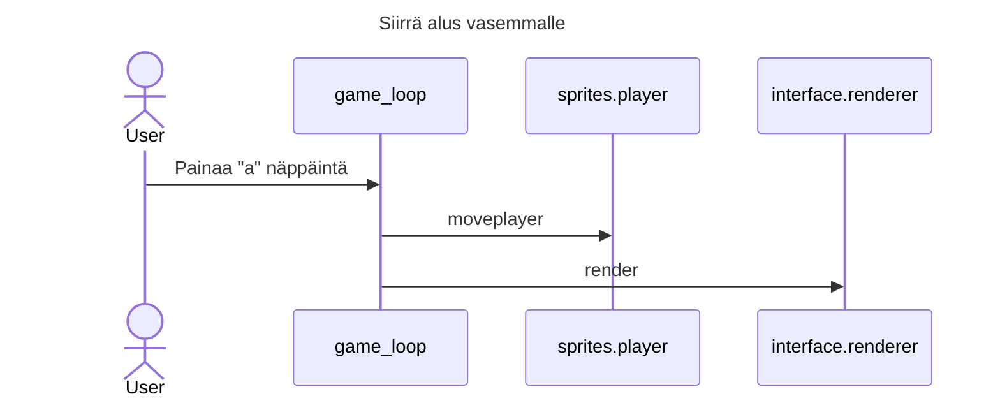
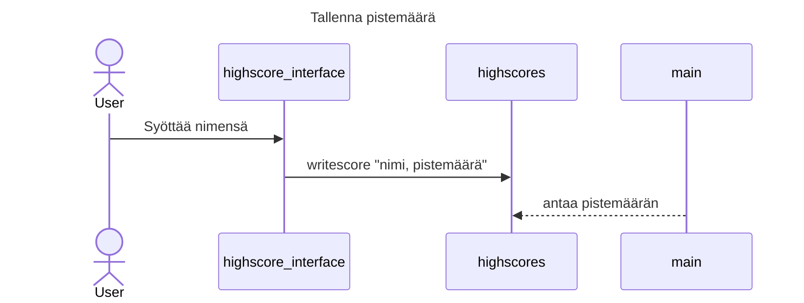

# Arkkitehtuuri

## Rakenne

Sovellus on jaettu kolmeen osaan, sprites sisältää näytöllä näkyvät oliot, interface sisältää käyttöliittymää
koskevan koodin, ja viimeinen osa on varsinainen sovelluslogiikka.


#### Luokkakaavio

## Käyttöliittymä

Käyttöliittymä koostuu kahdesta eri näkymästä. Varsinainen graaphinen pelinäkymä, sekä terminaalin highscore näkymä. Käyttölittymä on eristetty varsinaisesta sovelluslogiikasta

## Sovelluslogiikka
Pääosa sovelluslogiikasta sijaitsee game_loop luokassa, joka hoitaa jokaisella ruudunpäivityksellä tehtävät tapahtumat. Luokka enemy_spawns sisältää tietoja, milloin ja mitä vihollisia ilmestyy näytölle.

#### Highscore tietojen talletus
Sovelluslogiikan highscores luokka tallentaa pelaajan pistemäärän csv tiedostoon highscore.csv muodossa:
```
WLF,950
JCK,400
```
Nimi ensin ja pistemäärä seuraavaksi.

## Päätoiminnallisuudet

Aluksen ohjaus:



Pisteiden talletus:
