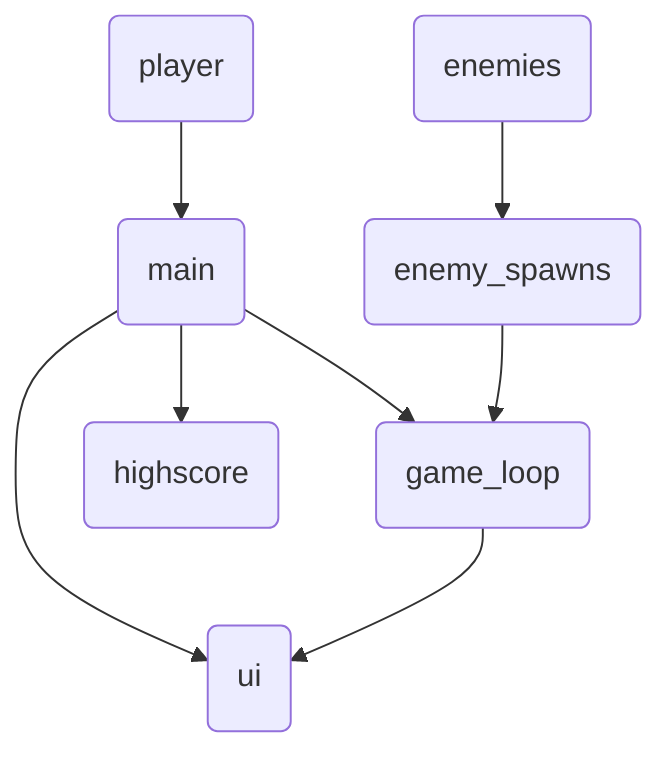

# Arkkitehtuuri

```mermaid

flowchart TD;

	main(main)
	ui(ui)
	game_loop(game_loop)
	player(player)
	enemy_spawns(enemy_spawns)
	enemies(enemies)
	highscore(highscore)
	
	main --> ui
	main --> game_loop
	player --> main
	enemy_spawns --> game_loop
	game_loop --> ui
	enemies --> enemy_spawns
	main --> highscore
	
```
